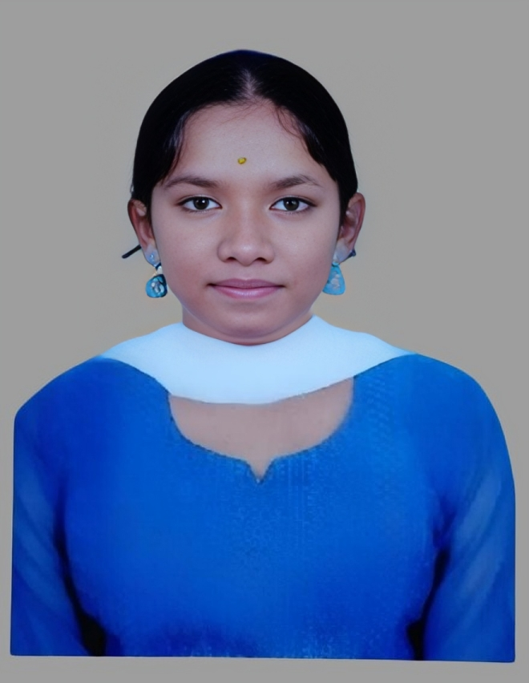

# Vanisha S — Portfolio

A single-page portfolio website with a Python/Flask backend and SQLite database.

## File Structure

```
portfolio/
├── index.html       ← main webpage
├── style.css        ← all styles
├── script.js        ← interactivity + API calls
├── server.py        ← Flask backend server
├── database.py      ← SQLite helpers
├── portfolio.db     ← auto-created on first run
└── assets/
    └── profile.jpg  ← (place your photo here)
```

## Step 1 — Install Python dependencies

Open a terminal **inside the portfolio folder** and run:

```
pip install flask flask-cors
```

## Step 2 — Run the server

```
python server.py
```

You should see:
```
  🚀  Vanisha's Portfolio Server
  Local :  http://localhost:5000
  Admin :  http://localhost:5000/admin
```

## Step 3 — Open in browser

Go to → **http://localhost:5000**

## Admin panel

View all contact form submissions at → **http://localhost:5000/admin**

## Adding your profile photo

1. Copy your photo into the `assets/` folder and name it `profile.jpg`
2. Open `index.html` in VS Code
3. Find the comment that says `TO ADD YOUR REAL PHOTO`
4. Replace `<div class="avatar">VS</div>` with:
   ```html
   
   ```
5. Save and refresh the browser

## Features

- Animated typing effect in the hero section
- Glassmorphism card design with floating orb background
- Skill bars animated on scroll
- Scroll-reveal animations for all sections
- Contact form saves messages to the SQLite database
- Live visitor counter stored in the database
- Mobile responsive with hamburger menu
- Admin page to view all received messages
